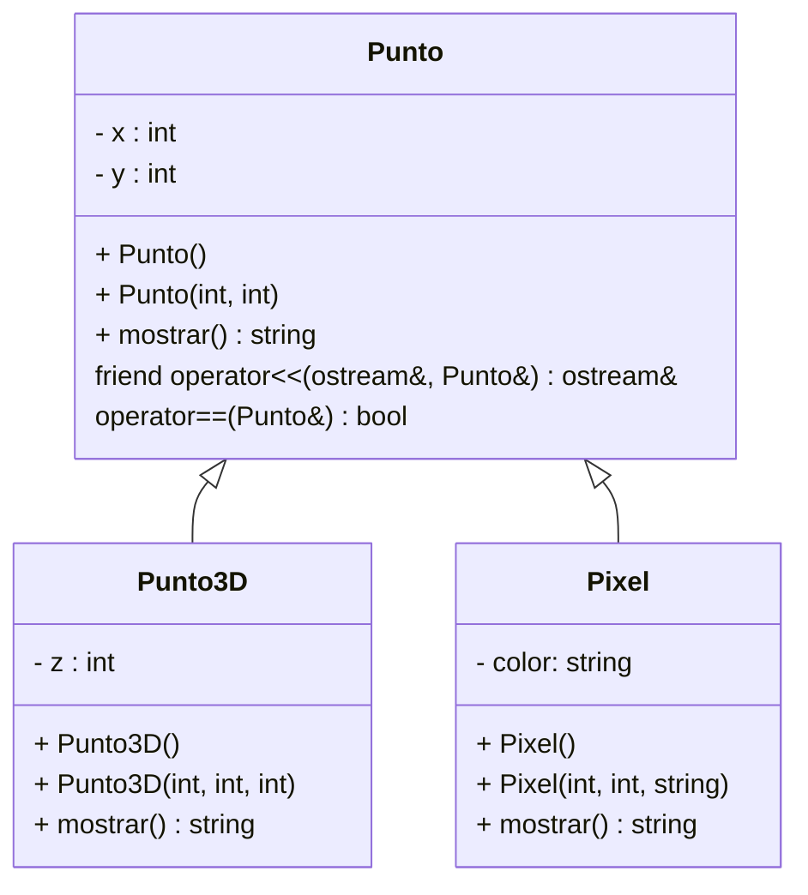

# Ejercicio-Autograding para C++ usando Catch2

**Fuente:** *Learning Autograding with C/C++ and Catch2 - Prof. Igor Machado Coelho* 
https://medium.com/swlh/easy-c-autograding-on-github-classroom-with-catch2-106ad1107402

# Instrucciones
**(60 puntos)** Implementa en C++ las clases mostradas en el diagrama de clases UML de abajo. Revisa en el apartado **Especificaciones**, algunos requerimientos que deberás considerar en la implementación.

## Diagrama de Clases

## Especificaciones

### Clase Punto 
- Define la clase Punto, el método mostrar deberá regresar en un string con la información del objeto y actuar polimórficamente en tiempo de ejecución.
- Implementa constructores, getters y setters. El constructor default deberá dar valor de 0 a x y de 1 a y.
- Sobrecarga el operador **==** como función friend o como función miembro tu lo decides. Un Punto será igual a otro si están en las misma coordenada (x,y).
- Sobrecarga el operador **<<**  Al usar en esta sobrecarga el método **mostrar()** que es polimórfico en tiempo de ejecución hará que nuestra sobrecarga sea útil para toda nuestra estructura de clases heredadas.

### Clase Punto3D – es un Punto
- Representa un punto en tercera dimensión.
- Agrega el atributo z. *(Para este examen implementa solo el get del atributo).* 
- Agrega los constructores (default y con parámetros). En el default asigna 1 a z.
- Escribe el método **mostrar()**

### Clase Pixel – es un Punto
- Representa un punto en la pantalla de un deteminado color
- Agrega el atributo color. *(Para este examen implementa solo el get del atributo).* 
- Agrega los constructores (default y con parámetros). En el default dale el valor predeterminado de color a "rojo". 
- Escribe el método **mostrar()**

### Programa principal

**(10 puntos)** En el programa principal:
- Crea un vector de apuntadores a Punto llamado puntitos.
- De manera dinámica crea:
 * En la posición 0 un objeto Punto con los valores que tú decidas (usar constructor con parámetros)
 * En la posición 1 un objeto Punto3D construido con el constructor default
 * En la posición 2 un objeto Pixel (usar constructor con parámetros con valores que tú decidas)

- Declara un objeto Punto llamado p1 con los datos: x = 0 y = 1
- Ahora recorre el vector para encontrar cual(es) de los puntos de tu vector son iguales que punto1. No se te olvide que lo que tienes guardado en el vector son **apuntadores a Contenedor** y recuerda que implementamos la sobrecarga del **operador ==** para Punto (debes usar este operador para esta parte del examen).
  * Si encuentras contenedores iguales a p1, sólo tienes que desplegar un mensaje a pantalla como este: *Punto en la posición X del vector tiene las misma coordenada x,y que p1” (donde X es el número correspondiente a la posición del arreglo donde está ese Punto que tiene igual coordenada que p1).
 * También conforme recorras el archivo ve imprimiendo a pantalla los datos de todos los Puntos del vector.

## Objetivo

- Busca que el código pase correctamente todas las pruebas, al pasar todas las pruebas te dará una calificación de 60, los 10 puntos restantes los pondrá la maestra directamente revisando el código del main.

   * Solamente cambia los archivos permitidos para lograr este objetivo (archivos de tus clases y el exercise.cpp como programa principal)
   
- Las GitHub Actions deberán presentar una palomita en verde si se han satisfecho todas las pruebas, y una cruz roja cuando alguna (o todas) las pruebas han fallado.
   * **Recomendación:** Puedes dar clic en la cruz roja para verificar cual de las pruebas ha fallado (o si el código no ha compilado correctamente).
   * **Recomendación:** En caso de que el Autograding no muestre pruebas o no funcione, contacta a tu profesor mediante un issue.

# Explicación de los otros archivos:

- Archivo `test/tests.cpp` tiene las pruebas de esta actividad (NO LO CAMBIES!)
- Archivo `test/catch.hpp` tiene la biblioteca de pruebas  CATCH2 (NO LA CAMBIES!)
- Archivo `makefile` tienes los comandos para ejecutar la actividad (NO LO CAMBIES!)
- Archivo  `./build/appTests` se generará después de compilar (para **pruebas locales**, solo ejecútalo)

## Comandos para pruebas locales, ejecución y depuración

- Comando para construir y ejecutar pruebas: `make` o `make test`
    * Si el ejecutable ya está construido, sólo teclea : `./build/appTests`

- Comando para construir y ejecutar la aplicación: `make run` 
    * Si el ejecutable ya está construido, sólo teclea : `./build/exercise`

- Comando para depurar: `make debug`
    * Para conocer los comandos de depuración consulta:
     https://u.osu.edu/cstutorials/2018/09/28/how-to-debug-c-program-using-gdb-in-6-simple-steps/
     
- Comando para depurar con `vsCode` en `GitPod`: `make debugvs` 
    * Utilizar el depurador de la IDE.     

## Notas

- El código será evaluado solamente si compila.
   * La razón de esto es, si no compila no es posible generar el ejecutable y realizar las pruebas.

- Algunos casos de prueba podrían recibir calificación individual, otros podrían recibir calificación y si pasan todos juntos (o todas las pruebas en conjunto).

- La calificación final se otorgará de manera automática en cada *commit*, y se evaluará solamente hasta la fecha limite de la actividad.

Para dudas adicionales, consulta a tu profesor.

## License

MIT License 2020
