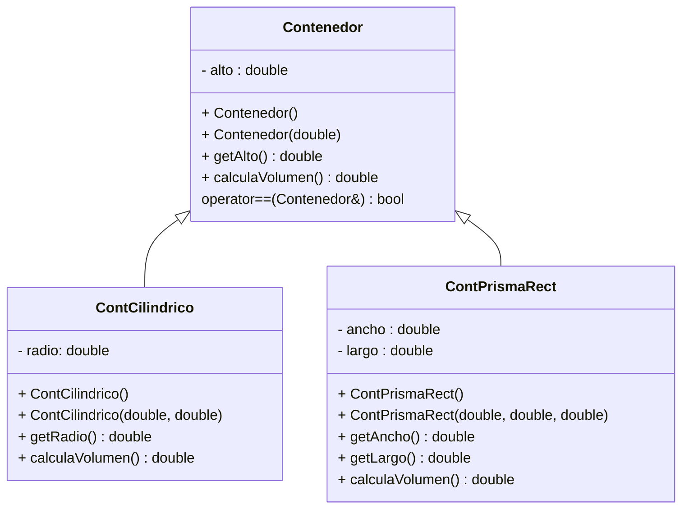

# Ejercicio-Autograding para C++ usando Catch2

**Fuente:** *Learning Autograding with C/C++ and Catch2 - Prof. Igor Machado Coelho* 
https://medium.com/swlh/easy-c-autograding-on-github-classroom-with-catch2-106ad1107402

# Instrucciones
**(60 puntos)** Implementa en C++ las clases mostradas en el diagrama de clases UML de abajo. Revisa en el apartado **Especificaciones**, algunos requerimientos que deberás considerar en la implementación.

## Diagrama de Clases

## Especificaciones

### Clase abstracta Contenedor 
- Define la clase Contenedor, el método calculaVolumen es virtual puro.
- Implementa constructores, getters y setters.
- Sobrecarga el operador == como función miembro de la clase. Un Contenedor será igual a otro si y solo si tiene **el mismo volumen**. Al usar el método **calculeVolumen()** que es polimórfico en tiempo de ejecución hará que nuestra sobrecarga sea útil para toda nuestra estructura de clases heredadas.

### Clase ContCilindrico – es un Contenedor
- Representa un contenedor de forma cilíndrica.
- Agrega el atributo radio. *(Para este examen implementa solo el get del atributo).* 
- Agrega los constructores (default y con parámetros).
- Escribe el método **calculaVolumen()**, te recuerdo que la fórmula para calcular el volumen de un cilindro es V=pi*radio*radio*altura. El valor de este volumen es lo que regresa el método.

### Clase ContPrismaRect – es un Contenedor
- Representa un contenedor de forma de prisma rectangular. 
- Agrega el atributo largo y ancho. *(Para este examen implementa solo el get de los atributos).* 
- Agrega los constructores (default y con parámetros).
- Escribe el método **calculaVolumen()**, te recuerdo que la fórmula para calcular el volumen de un prisma rectangular es V=largo*ancho*altura. El valor de este volumen es lo que regresa el método.

### Programa principal

**(10 puntos)** En el programa principal:
- Crea un vector de apuntadores a Contenedor llamado contenedores.
- De manera dinámica crea:
 * En la posición 0 un objeto ContCilindrico de alto 10 y radio 5.
 * En la posición 1 un objeto ContPrismaRect de alto 6, ancho 3 y largo 2.
 * En la posición 2 un objeto ContCilindrico de alto 6 y radio 4.

- Declara un objeto ContCilindrico llamado cilindro1 con los datos: altura 10 y radio 5
- Ahora recorre el vector para encontrar cual(es) de los contenedores son iguales que cilindro1. No se te olvide que lo que tienes guardado en el vector son **apuntadores a Contenedor** y recuerda que implementamos la sobrecarga del **operador ==** para Contenedores (debes usar este operador para esta parte del examen).
  * Si encuentras contenedores iguales a cilindro1, sólo tienes que desplegar un mensaje a pantalla como este: *Contenedor en la posición X tiene la misma capacidad que cilindro1” (donde X es el número correspondiente a la posición del arreglo donde está ese contenedor que tiene igual volumen que cilindro1).
 * También conforme recorras el archivo ve imprimiendo a pantalla el volumen de cada contenedor usa un buen formato para el mensaje.

## Objetivo

- Busca que el código pase correctamente todas las pruebas, al pasar todas las pruebas te dará una calificación de 60, los 10 puntos restantes los pondrá la maestra directamente revisando el código del main.

   * Solamente cambia los archivos permitidos para lograr este objetivo (archivos de tus clases y el exercise.cpp como programa principal)
   
- Las GitHub Actions deberán presentar una palomita en verde si se han satisfecho todas las pruebas, y una cruz roja cuando alguna (o todas) las pruebas han fallado.
   * **Recomendación:** Puedes dar clic en la cruz roja para verificar cual de las pruebas ha fallado (o si el código no ha compilado correctamente).
   * **Recomendación:** En caso de que el Autograding no muestre pruebas o no funcione, contacta a tu profesor mediante un issue.

# Explicación de los otros archivos:

- Archivo `test/tests.cpp` tiene las pruebas de esta actividad (NO LO CAMBIES!)
- Archivo `test/catch.hpp` tiene la biblioteca de pruebas  CATCH2 (NO LA CAMBIES!)
- Archivo `makefile` tienes los comandos para ejecutar la actividad (NO LO CAMBIES!)
- Archivo  `./build/appTests` se generará después de compilar (para **pruebas locales**, solo ejecútalo)

## Comandos para pruebas locales, ejecución y depuración

- Comando para construir y ejecutar pruebas: `make` o `make test`
    * Si el ejecutable ya está construido, sólo teclea : `./build/appTests`

- Comando para construir y ejecutar la aplicación: `make run` 
    * Si el ejecutable ya está construido, sólo teclea : `./build/exercise`

- Comando para depurar: `make debug`
    * Para conocer los comandos de depuración consulta:
     https://u.osu.edu/cstutorials/2018/09/28/how-to-debug-c-program-using-gdb-in-6-simple-steps/
     
- Comando para depurar con `vsCode` en `GitPod`: `make debugvs` 
    * Utilizar el depurador de la IDE.     

## Notas

- El código será evaluado solamente si compila.
   * La razón de esto es, si no compila no es posible generar el ejecutable y realizar las pruebas.

- Algunos casos de prueba podrían recibir calificación individual, otros podrían recibir calificación y si pasan todos juntos (o todas las pruebas en conjunto).

- La calificación final se otorgará de manera automática en cada *commit*, y se evaluará solamente hasta la fecha limite de la actividad.

Para dudas adicionales, consulta a tu profesor.

## License

MIT License 2020
